<h1 align="center">
Awesome-ID-Customization 
</h1>

 An Awesome Collection for ID Customization  

 收集和梳理人物自定义相关 

  
  
  

本项目持续收集和梳理人物/主体自定义（ID Customization、Subject-Driven Generation）相关的开源模型、论文、测评与数据集。重点关注参考身份或主体的一致性保持，以及一致性、提示词遵循、可编辑性和生成多样性之间的平衡。目前 DiT、Flow Transformer 与统一多模态生成模型已成为主要技术路线，本项目同时保留经典 UNet 方法，并覆盖图像与视频自定义。

如果本项目能给您带来一点点帮助，麻烦点个⭐️吧～

同时也欢迎大家贡献本项目未收录的开源模型、应用、数据集等。提供新的仓库信息请发起 PR，并按照本项目的格式提供仓库链接、Star 数、简介等相关信息，感谢～

## 收录范围

- **收录**：以一张或多张参考图像/身份为条件，在新文本、场景、姿态、布局或视频运动中保持人物 ID 或通用主体特征的方法。
- **单独整理**：直接服务于主体一致性生成的测评指标、benchmark 和训练数据集。
- **暂不收录**：仅做检索/识别、隐私攻击与防护、换装/妆发迁移、图像修复、换脸、纯 3D Avatar 或 Talking Head，且没有通用自定义生成贡献的工作。

## 最近更新

- **2026-07-19（精细检索）**：按人物 ID、通用主体、多主体/布局、图像/视频、训练式/免训练、测评与数据集等方向交叉检索，方法全景表扩展至 **71 项**。
- 本轮新增 Identity Tuning、DeGu、Sparse Context、SwiftPie、ASTRA、DisCo、MS-CustomNet、IdGlow、FlowFixer、DreamVAR、MOSAIC、ContextGen、LayerComposer、AnyMS，以及 3 项测评和 4 个数据集。
- 同步更新项目范围、架构分类和论文原始架构图；年份以论文或项目首次公开时间为准。

## 目录
- [收录范围](#收录范围)
- [最近更新](#最近更新)
- [目录](#目录)
  
  - [1. 人物自定义模型](#1-人物自定义模型)
    
    - [1.1 方法全景表](#11-方法全景表)
    - [1.2 基于 DiT / Flow Transformer 架构](#dit-models)
    - [1.3 基于 UNet 架构](#unet-models)
    - [1.4 自回归与其他架构](#other-models)
  - [2. 测评](#2-测评)
  - [3. 数据集](#3-数据集)
  
- [Star History](#star-history)

###  1. 人物自定义模型

#### 1.1 方法全景表

| 方法 | 年份 | 基座/架构 | 任务范式 | ID/主体能力 | 链接 |
|------|------|-----------|----------|-------------|------|
| **EditID** | 2025 | Flux / DiT | Training-free editable ID customization | 单人 ID，可编辑性 | [GitHub](https://github.com/leeguandong/IBench) |
| **EditIDv2** | 2025 | Flux / DiT | Data-lubricated ID feature integration | 单人 ID，长文本编辑 | [GitHub](https://github.com/typemovie/EditIDv2) |
| **PuLID** | 2024 | SD / Flux | Contrastive ID alignment | 单人 ID，轻量快速 | [GitHub](https://github.com/ToTheBeginning/PuLID) |
| **FLUX-customID** | 2024 | Flux | ID adapter / customization | 单人 ID，真实感定制 | [GitHub](https://github.com/damo-cv/FLUX-customID) |
| **ConsisID** | 2024 | Video DiT | Frequency decomposition for T2V | 单人 ID 视频 | [GitHub](https://github.com/PKU-YuanGroup/ConsisID) |
| **InfiniteYou** | 2025 | Flux / DiT | Flexible photo recrafting | 单人 ID，照片重绘 | [GitHub](https://github.com/bytedance/InfiniteYou) |
| **UNO** | 2025 | DiT | In-context subject generation | 单/多主体，少样本上下文 | [GitHub](https://github.com/bytedance/UNO) |
| **ACE++** | 2025 | DiT | Instruction image creation/editing | 上下文填充，主体/风格编辑 | [GitHub](https://github.com/ali-vilab/ACE_plus) |
| **Personalize Anything** | 2025 | DiT | Free personalization | 通用主体定制 | [GitHub](https://github.com/fenghora/personalize-anything) |
| **Diptych** | 2025 | Flux / Inpainting | Zero-shot subject-driven generation | 任意主体，inpainting 条件 | [GitHub](https://github.com/wuyou22s/Diptych) |
| **DynamicID** | 2025 | DiT | Zero-shot multi-ID personalization | 多 ID，脸部可编辑 | [arXiv](https://arxiv.org/abs/2503.06505) |
| **InstantCharacter** | 2025 | DiT | Scalable character personalization | 角色一致性 | [GitHub](https://github.com/Tencent/InstantCharacter) |
| **RealCustom++** | 2025 | DiT | Real-word representation | 实时主体定制 | [GitHub](https://github.com/bytedance/RealCustom) |
| **DreamO** | 2025 | DiT | Unified image customization | 通用图像定制 | [GitHub](https://github.com/bytedance/DreamO) |
| **FlexIP** | 2025 | DiT | Preservation / personality control | 保真度与个性化可控 | [arXiv](https://arxiv.org/abs/2504.07405) |
| **XVerse** | 2025 | DiT | DiT modulation | 多主体 ID + 语义属性控制 | [GitHub](https://github.com/bytedance/XVerse) |
| **UMO** | 2025 | DiT / RL | Matching reward optimization | 多 ID 一致性与防混淆 | [GitHub](https://github.com/bytedance/UMO) |
| **FaceCLIP** | 2025 | DiT | Joint ID-textual representation | ID-文本联合表征 | [GitHub](https://github.com/bytedance/FaceCLIP) |
| **USO** | 2025 | DiT | Style / subject disentanglement | 风格 + 主体统一生成 | [GitHub](https://github.com/bytedance/USO) |
| **IC-Custom** | 2025 | DiT | In-context image customization | 上下文主体定制 | [GitHub](https://github.com/TencentARC/IC-Custom) |
| **WithAnyone** | 2025 | DiT | Controllable ID-consistent generation | 人物 ID 可控生成 | [GitHub](https://github.com/Doby-Xu/WithAnyone) |
| **MagicMirror** | 2025 | Video DiT | ID-preserved video generation | 单人 ID 视频 | [GitHub](https://github.com/JIA-Lab-research/MagicMirror) |
| **ExpPortrait** | 2026 | DiT | Expressive portrait generation | 表情化肖像定制 | [arXiv](https://arxiv.org/abs/2602.19900) |
| **AnyPhoto** | 2026 | DiT | Location-canvas ID modulation | 多人 ID，位置绑定 | [arXiv](https://arxiv.org/abs/2603.14770) |
| **PositionIC** | 2025 | DiT | Position + identity consistency | 位置控制 + ID 一致 | [GitHub](https://github.com/MeiGen-AI/PositionIC) |
| **MultiCrafter** | 2025 | DiT | Disentangled attention + preference alignment | 多主体高保真生成 | [arXiv](https://arxiv.org/abs/2509.21953) |
| **LatentUnfold** | 2025 | Flux / DiT | Training-free subject activation | 无训练主体驱动生成 | [GitHub](https://github.com/bytedance/LatentUnfold) |
| **Scone** | 2026 | Unified model | Composition + distinction modeling | 多主体组合与目标主体区分 | [GitHub](https://github.com/Ryann-Ran/Scone) |
| **MagicView** | 2025 | DiT | Priors-guided in-context learning | 单图到多视角 ID 一致 | [arXiv](https://arxiv.org/abs/2511.00293) |
| **Proteus-ID** | 2025 | Video DiT | ID-consistent video customization | 单人 ID，运动一致视频 | [GitHub](https://github.com/grenoble-zhang/Proteus-ID) |
| **DivRL** | 2026 | Post-training / RL | Identity-diversity reward optimization | 主体一致性 + 多样性 | [GitHub](https://github.com/QianWangX/DivRL) |
| **Pose-ICL** | 2026 | FLUX / DiT | 3D-aware in-context learning | 主体 ID + 连续视角/姿态控制 | [arXiv](https://arxiv.org/abs/2606.10902) |
| **CustomShift** | 2026 | SD3 / MM-DiT | Attention distribution shift | 多参考主体一致性 + 文本对齐 | [arXiv](https://arxiv.org/abs/2606.16866) |
| **RAVA** | 2026 | FLUX.2 / DiT | Retrieval-augmented viewpoint alignment | 跨主体视角对齐 + 多参考选择 | [arXiv](https://arxiv.org/abs/2606.17619) |
| **Aura** | 2026 | Wan2.2 / Video DiT | VLM-grounded multi-reference conditioning | 多人物/物体/场景一致视频 | [arXiv](https://arxiv.org/abs/2607.04311) |
| **MOSAIC** | 2025 | FLUX / DiT | Correspondence alignment + feature disentanglement | 多主体语义对应 + 防属性泄漏 | [Project](https://bytedance-fanqie-ai.github.io/MOSAIC/) |
| **ContextGen** | 2025 | FLUX / DiT | Contextual layout anchoring | 多实例布局 + ID 一致性 | [GitHub](https://github.com/nenhang/ContextGen) |
| **LayerComposer** | 2025 | FLUX Kontext / DiT | Layered-canvas conditioning | 多人物交互式位置/尺寸控制 | [Project](https://snap-research.github.io/layercomposer/) |
| **IdGlow** | 2026 | Flow Matching / DiT | Dynamic identity modulation | 可变数量多 ID + 结构变形 | [arXiv](https://arxiv.org/abs/2603.00607) |
| **DisCo** | 2026 | FLUX / DiT | Identity-text disentangle and re-couple | 主体保真度 + 文本可控性 | [arXiv](https://arxiv.org/abs/2604.00849) |
| **ASTRA** | 2026 | DiT | Retrieval-augmented pose guidance | 多主体 ID + 复杂姿态 | [arXiv](https://arxiv.org/abs/2604.13938) |
| **Sparse Context** | 2026 | FLUX.2 / DiT | Reference-token dropping | 多参考条件加速 + 显存节省 | [Project](https://sparsecontext.github.io/) |
| **DeGu** | 2026 | Backbone-agnostic | Decoupled subject/context guidance | 保真度与可编辑性独立控制 | [arXiv](https://arxiv.org/abs/2607.00766) |
| **Identity Tuning** | 2026 | FLUX / DiT | Training-free latent identity directions | 细粒度脸部属性编辑 + ID 稳定 | [Project](https://garibida.github.io/IdentityTuning/) |
| **PortraitBooth** | 2023 | UNet | Fast portrait personalization | 单人肖像定制 | [Project](https://portraitbooth.github.io/) |
| **DreamIdentity** | 2023 | UNet | Face-identity preserved generation | 单人 ID，编辑性增强 | [arXiv](https://arxiv.org/abs/2307.00300) |
| **ConsistentID** | 2024 | UNet | Multimodal fine-grained ID preserving | 单人肖像生成 | [GitHub](https://github.com/JackAILab/ConsistentID) |
| **PhotoMaker** | 2024 | UNet / SDXL | Stacked ID embedding | 单人/多人照片定制 | [GitHub](https://github.com/TencentARC/PhotoMaker) |
| **IDAdapter** | 2024 | UNet | Mixed feature adapter | Tuning-free 个性化 | [arXiv](https://arxiv.org/abs/2403.13535) |
| **InstantID** | 2024 | UNet / SDXL | Plug-and-play IdentityNet | 单图零样本 ID 保持 | [GitHub](https://github.com/instantX-research/InstantID) |
| **Character-Adapter** | 2024 | UNet | Region-controlled character adapter | 角色区域控制 | [GitHub](https://github.com/Character-Adapter/Character-Adapter) |
| **Face Adapter** | 2024 | UNet | Fine-grained ID / attribute adapter | ID + 属性控制 | [GitHub](https://github.com/FaceAdapter/Face-Adapter) |
| **FastComposer** | 2023 | UNet | Localized attention | 多主体免训练生成 | [GitHub](https://github.com/open-mmlab/mmagic/tree/main/configs/fastcomposer) |
| **IC-Portrait** | 2025 | UNet | In-context portrait matching | 视角一致肖像生成 | [arXiv](https://arxiv.org/abs/2501.17159) |
| **MasterWeaver** | 2024 | UNet | Editability / identity balancing | 人物个性化编辑 | [GitHub](https://github.com/csyxwei/MasterWeaver) |
| **PhotoVerse** | 2023 | UNet | Tuning-free image customization | 图像主体定制 | [GitHub](https://github.com/idonahum/photoVerse) |
| **UniPortrait** | 2024 | UNet | Unified single / multi-human personalization | 单人/多人 ID | [GitHub](https://github.com/junjiehe96/UniPortrait) |
| **RealisID** | 2024 | UNet | Local-global complementation | 小脸/位置/姿态可控 | [arXiv](https://arxiv.org/abs/2412.16832) |
| **FlashFace** | 2024 | UNet | High-fidelity human personalization | 高保真人脸定制 | [GitHub](https://github.com/ali-vilab/FlashFace) |
| **CrossFaceID** | 2024 | UNet | Cross-training data | FaceID customization | [GitHub](https://github.com/ShuheSH/CrossFaceID) |
| **DreamID** | 2024 | UNet | Triplet ID group learning | 快速高保真人脸交换 | [GitHub](https://github.com/superhero-7/DreamID) |
| **ID-Booth** | 2023 | UNet | Identity-consistent face generation | 单人脸生成 | [GitHub](https://github.com/dariant/ID-Booth) |
| **FaceSnap** | 2026 | UNet | ID-fidelity network | Tuning-free portrait customization | [arXiv](https://arxiv.org/abs/2602.00627) |
| **Diff-PC** | 2026 | UNet | 3D-aware controllable diffusion | 零样本肖像定制 | [arXiv](https://arxiv.org/abs/2602.00639) |
| **UniID** | 2025 | UNet | Training for identity, inference for control | 免调参人脸个性化 | [GitHub](https://github.com/lyuPang/UniID) |
| **SPaRa-DCAL** | 2026 | SDXL / UNet | Stage-aware LoRA + candidate calibration | 单主体 ID、文本与多样性平衡 | [arXiv](https://arxiv.org/abs/2607.07173) |
| **AnyMS** | 2025 | SDXL / UNet | Training-free attention decoupling | 多主体布局 + 文本/ID 平衡 | [arXiv](https://arxiv.org/abs/2512.23537) |
| **FlowFixer** | 2026 | SDXL / UNet | Reference-guided detail refinement | 跨尺度/视角高频细节恢复 | [arXiv](https://arxiv.org/abs/2602.21402) |
| **MS-CustomNet** | 2026 | LDM / UNet | Hierarchical relational semantics | 多主体层级关系 + 空间布局 | [arXiv](https://arxiv.org/abs/2603.21136) |
| **SwiftPie** | 2026 | SD 1.5/SDXL / UNet | One-step identity injection | 单步实时主体个性化 | [arXiv](https://arxiv.org/abs/2605.01510) |
| **DreamVAR** | 2026 | Visual Autoregressive | Subject pre-filling + GRPO | 自回归主体一致生成 | [arXiv](https://arxiv.org/abs/2601.22507) |

> 备注：年份按论文或项目公开时间粗略标注，详细信息以下方条目与原论文/仓库为准。

#### 1.2 基于 DiT / Flow Transformer 架构

* **EditID: Training-Free Editable ID Customization for Text-to-Image Generation**
  
  * 地址：https://github.com/leeguandong/IBench 
  * 架构图：
  
   

* **EditIDv2: Editable ID Customization with Data-Lubricated ID Feature Integration for Text-to-Image Generation**
  
  * 地址：https://github.com/typemovie/EditIDv2 
  * 架构图：
  
  

* **PuLID: Pure and Lightning ID Customization via Contrastive Alignment**
  
  * 地址：https://github.com/ToTheBeginning/PuLID   
  * 架构图：
  
   
  
* **FLUX-customID: Realistically Customize Your Personal ID to Perfection**
  
  * 地址：https://github.com/damo-cv/FLUX-customID     
  * [comfyui](https://github.com/leeguandong/ComfyUI_FluxCustomId)：
  
   
  
* **Identity-Preserving Text-to-Video Generation by Frequency Decomposition**
  
  * 地址：https://github.com/PKU-YuanGroup/ConsisID 
  * 架构图：
  
  

* **InfiniteYou: Flexible Photo Recrafting While Preserving Your Identity**
  
  * 地址：https://github.com/bytedance/InfiniteYou 
  * 架构图：
  
  

* **Less-to-More Generalization: Unlocking More Controllability by In-Context Generation**
  
  * 地址：https://github.com/bytedance/UNO 
  * 架构图：
  
  

* **ACE++: Instruction-Based Image Creation and Editing via Context-Aware Content Filling**
  
  * 地址：https://github.com/ali-vilab/ACE_plus 
  * 架构图：
  
  

* **Personalize Anything for Free with Diffusion Transformer**
  
  * 地址：https://github.com/fenghora/personalize-anything 
  * 架构图：
  
  

* **Large-Scale Text-to-Image Model with Inpainting is a Zero-Shot Subject-Driven Image Generator**
  
  * 地址：https://github.com/wuyou22s/Diptych 
  * 架构图：
  
  

* **DynamicID: Zero-Shot Multi-ID Image Personalization with Flexible Facial Editability**
  
  * 地址：https://arxiv.org/abs/2503.06505
  * 架构图：
  
  

* **InstantCharacter: Personalize Any Characters with a Scalable Diffusion Transformer Framework**
  
  * 地址：https://github.com/Tencent/InstantCharacter 
  * 架构图：
  
  

* **RealCustom++: Representing Images as Real Text Word for Real-Time Customization**
  
  * 地址：https://github.com/bytedance/RealCustom 
  * 架构图：
  
  

* **DreamO: A Unified Framework for Image Customization**
  
  * 地址：https://github.com/bytedance/DreamO 
  * 架构图：
  
  

* **FlexIP: Dynamic Control of Preservation and Personality for Customized Image Generation**
  
  * 地址：https://arxiv.org/abs/2504.07405
  * 架构图：
  
  

* **XVerse: Consistent Multi-Subject Control of Identity and Semantic Attributes via DiT Modulation**
  
  * 地址：https://github.com/bytedance/XVerse 
  * 架构图：
  
  

* **UMO: Scaling Multi-Identity Consistency for Image Customization via Matching Reward**
  
  * 地址：https://github.com/bytedance/UMO 
  * 架构图：
  
  

* **Learning Joint ID-Textual Representation for ID-Preserving Image Synthesis**
  
  * 地址：https://github.com/bytedance/FaceCLIP 
  * 架构图：
  
  

* **USO: Unified Style and Subject-Driven Generation via Disentangled and Reward Learning**

  * 地址：https://github.com/bytedance/USO 
  * 架构图：

  

* **IC-Custom: Diverse Image Customization via In-Context Learning**

  * 地址：https://github.com/TencentARC/IC-Custom 
  * 架构图：

  

* **WithAnyone: Towards Controllable and ID Consistent Image Generation**

  * 地址：https://github.com/Doby-Xu/WithAnyone 
  * 架构图：

  

* **MagicMirror: ID-Preserved Video Generation in Video Diffusion Transformers**

  * 地址：https://github.com/JIA-Lab-research/MagicMirror 
  * 架构图：

  

* **ExpPortrait: Expressive Portrait Generation via Personalized Representation**

  * 地址：https://arxiv.org/abs/2602.19900
  * 架构图：

  

* **AnyPhoto: Multi-Person Identity Preserving Image Generation with ID Adaptive Modulation on Location Canvas**

  * 地址：https://arxiv.org/abs/2603.14770
  * 架构图：

  

* **PositionIC: Unified Position and Identity Consistency for Image Customization**

  * 地址：https://github.com/MeiGen-AI/PositionIC 
  * 架构图：

  

* **MultiCrafter: High-Fidelity Multi-Subject Generation via Disentangled Attention and Identity-Aware Preference Alignment**

  * 地址：https://arxiv.org/abs/2509.21953
  * 架构图：

  

* **Flux Already Knows: Activating Subject-Driven Image Generation without Training**

  * 地址：https://github.com/bytedance/LatentUnfold 
  * 架构图：

  

* **Scone: Bridging Composition and Distinction in Subject-Driven Image Generation via Unified Understanding-Generation Modeling**

  * 地址：https://github.com/Ryann-Ran/Scone 
  * 架构图：

  

* **MagicView: Multi-View Consistent Identity Customization via Priors-Guided In-Context Learning**

  * 地址：https://arxiv.org/abs/2511.00293
  * 架构图：

  

* **Proteus-ID: ID-Consistent and Motion-Coherent Video Customization**

  * 地址：https://github.com/grenoble-zhang/Proteus-ID 
  * 架构图：

  

* **DivRL: Disentangled Self-Similarity Rewards for Diverse Subject-Driven Generation**

  * 地址：https://github.com/QianWangX/DivRL 
  * 架构图：

  

* **Pose-ICL: 3D-Aware In-Context Learning for Pose-Controllable Subject Customization**

  * 地址：https://arxiv.org/abs/2606.10902
  * 架构图：

  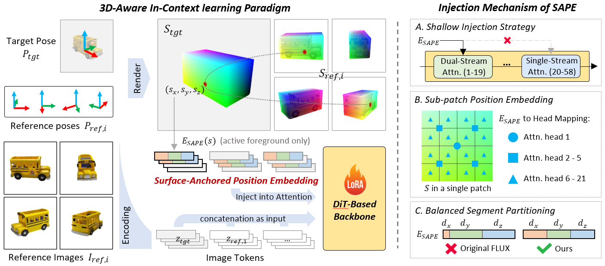

* **CustomShift — Redirecting the Flow: Image Customization through Attention Distribution Shift**

  * 地址：https://arxiv.org/abs/2606.16866
  * 架构图：

  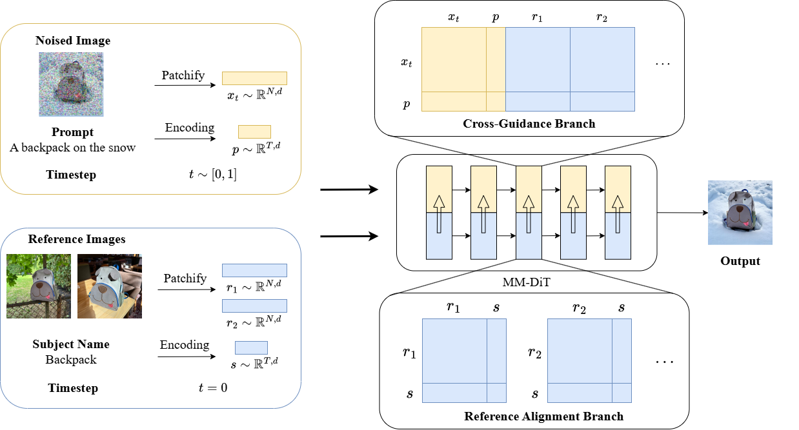

* **RAVA: Retrieval-Augmented Viewpoint Alignment for Subject-Driven Image Generation**

  * 地址：https://arxiv.org/abs/2606.17619
  * 架构图：

  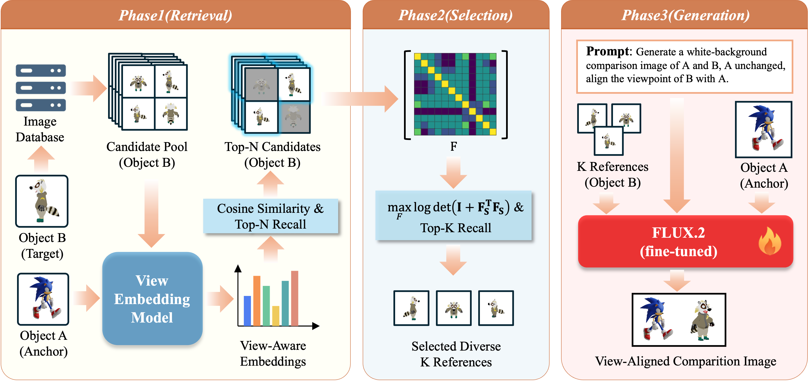

* **Aura: Consistent Multi-Subject Video Generation via VLM-Grounded Semantic Alignment**

  * 地址：https://arxiv.org/abs/2607.04311
  * 架构图：

  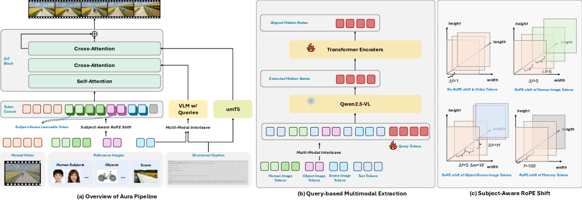

* **MOSAIC: Multi-Subject Personalized Generation via Correspondence-Aware Alignment and Disentanglement**

  * 地址：https://bytedance-fanqie-ai.github.io/MOSAIC/
  * 架构图：

  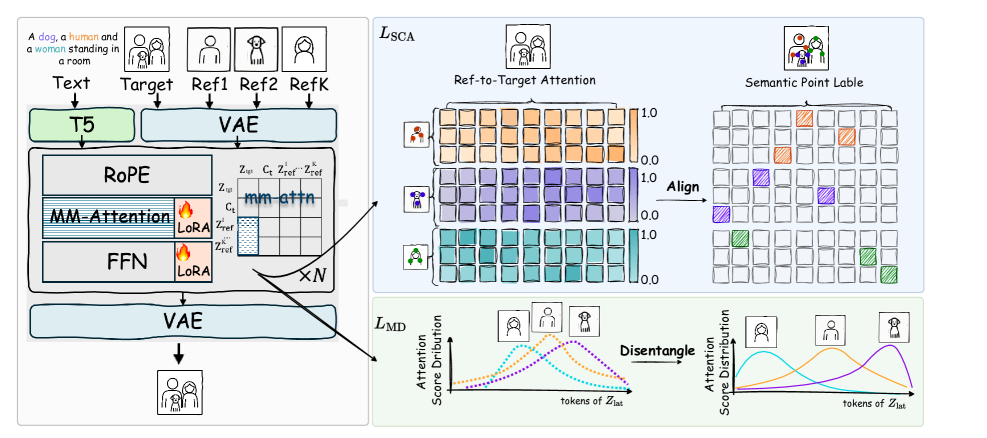

* **ContextGen: Contextual Layout Anchoring for Identity-Consistent Multi-Instance Generation**

  * 地址：https://github.com/nenhang/ContextGen 
  * 架构图：

  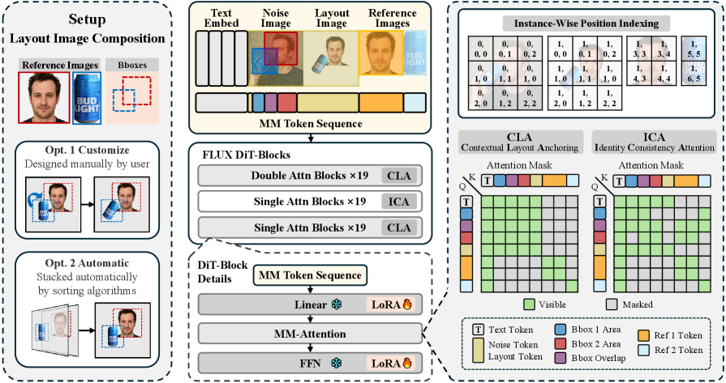

* **LayerComposer: Multi-Human Personalized Generation via Layered Canvas**

  * 地址：https://snap-research.github.io/layercomposer/
  * 架构图：

  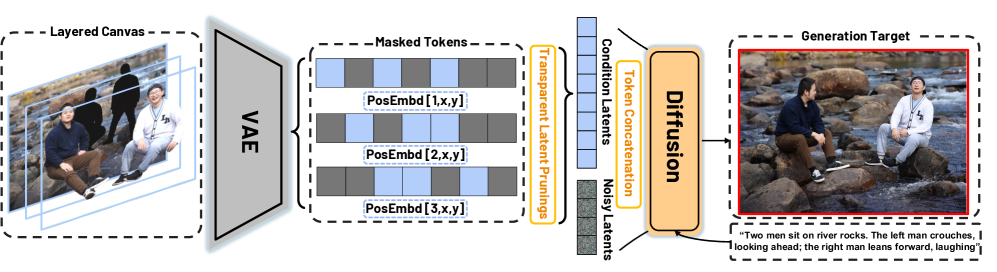

* **IdGlow: Dynamic Identity Modulation for Multi-Subject Generation**

  * 地址：https://arxiv.org/abs/2603.00607
  * 架构图：

  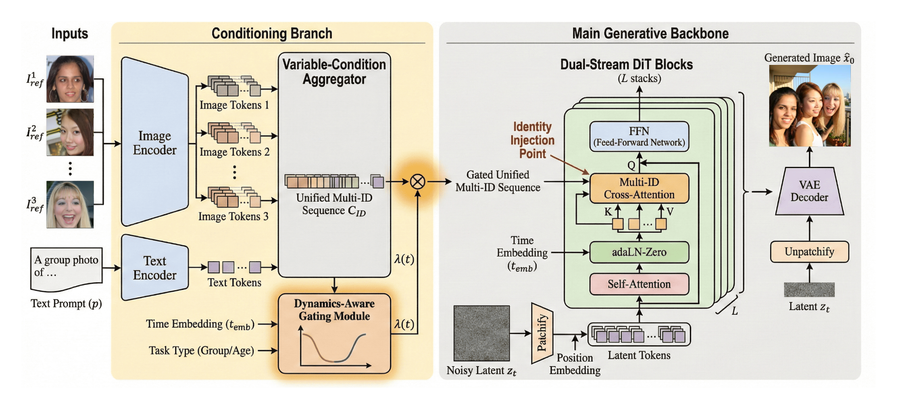

* **DisCo — Disentangling to Re-couple: Resolving the Similarity-Controllability Paradox in Subject-Driven Text-to-Image Generation**

  * 地址：https://arxiv.org/abs/2604.00849
  * 架构图：

  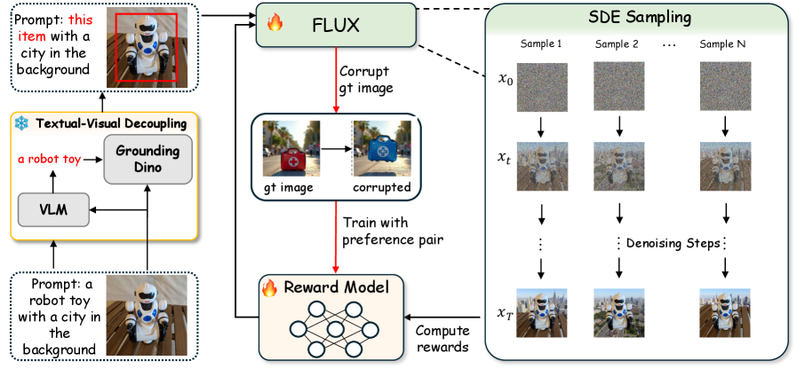

* **ASTRA: Enhancing Multi-Subject Generation with Retrieval-Augmented Pose Guidance and Disentangled Position Embedding**

  * 地址：https://arxiv.org/abs/2604.13938
  * 架构图：

  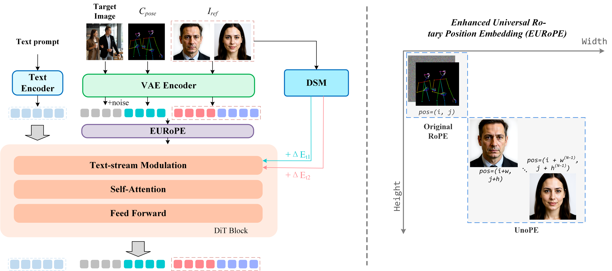

* **Sparse Context — Keep The Essentials: Efficient Reference Conditioned Generation via Token Dropping**

  * 地址：https://sparsecontext.github.io/
  * 架构图：

  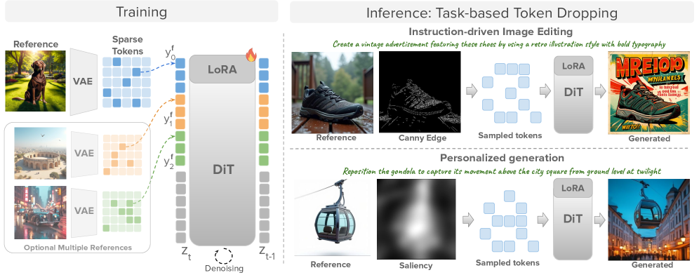

* **DeGu — Decoupled Guidance: Disentangling Subject and Context Pathways in Text-to-Image Personalization**

  * 地址：https://arxiv.org/abs/2607.00766
  * 架构图：

  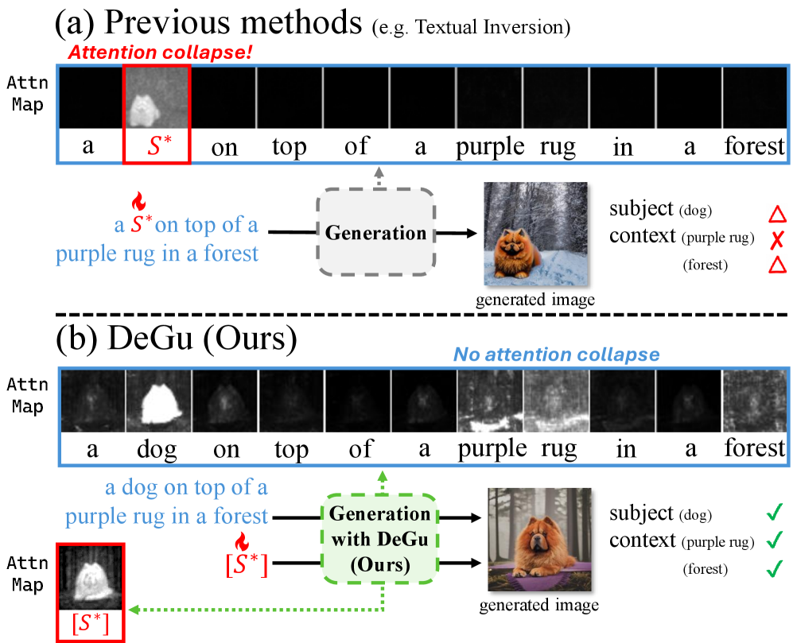

* **Latent-Identity Tuning in Text-to-Image Personalization Models**

  * 地址：https://garibida.github.io/IdentityTuning/
  * 架构图：

  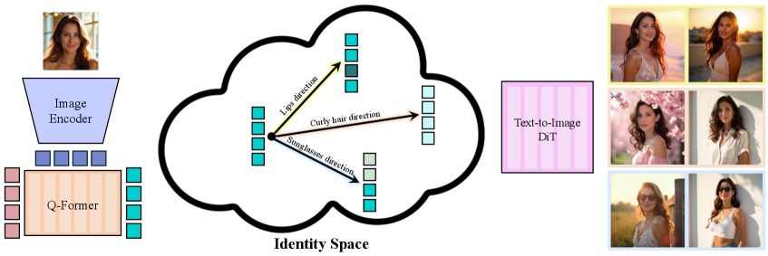

#### 1.3 基于 UNet 架构

* **PortraitBooth: A Versatile Portrait Model for Fast Identity-preserved Personalization**
  
  * 地址：https://portraitbooth.github.io/
  * 架构图：
  
  
  
* **DreamIdentity: Improved Editability for Efficient Face-identity Preserved Image Generation**
  
  * 地址：https://arxiv.org/abs/2307.00300
  * 架构图：
  
  
  
* **ConsistentID : Portrait Generation with Multimodal Fine-Grained Identity Preserving**
  
  * 地址：https://github.com/JackAILab/ConsistentID   
  * 架构图：
  
  
  
* **PhotoMaker: Customizing Realistic Human Photos via Stacked ID Embedding**

  * 地址：https://github.com/TencentARC/PhotoMaker 
  * 架构图：

  

* **IDAdapter: Learning Mixed Features for Tuning-Free Personalization of Text-to-Image Models**

  * 地址：https://arxiv.org/abs/2403.13535
  * 架构图：

  

* **InstantID: Zero-shot Identity-Preserving Generation in Seconds**

  * 地址：https://github.com/instantX-research/InstantID 
  * 架构图：

  
  
* **Character-Adapter: Prompt-Guided Region Control for High-Fidelity Character Customization**

  * 地址：https://github.com/Character-Adapter/Character-Adapter 
  * 架构图：

  

* **Face Adapter for Pre-Trained Diffusion Models with Fine-Grained ID and Attribute Control**

  * 地址：https://github.com/FaceAdapter/Face-Adapter 
  * 架构图：

  

* **FastComposer: Tuning-Free Multi-Subject Image Generation with Localized Attention**

  * 地址：https://github.com/open-mmlab/mmagic/tree/main/configs/fastcomposer 
  * 架构图：

  

* **IC-Portrait: In-Context Matching for View-Consistent Personalized Portrait Generation**

  * 地址：https://arxiv.org/abs/2501.17159
  * 架构图：

  

* **MasterWeaver: Taming Editability and Identity for Personalized Text-to-Image Generation**

  * 地址：https://github.com/csyxwei/MasterWeaver 
  * 架构图：

  

* **PhotoVerse: Tuning-Free Image Customization with Text-to-Image Diffusion Models**

  * 地址：https://github.com/idonahum/photoVerse 
  * 架构图：

  

* **UniPortrait: A Unified Framework for Identity-Preserving Single- and Multi-Human Image Personalization**

  * 地址：https://github.com/junjiehe96/UniPortrait 
  * 架构图：

  

* **RealisID: Scale-Robust and Fine-Controllable Identity Customization via Local and Global Complementation**

  * 地址：https://arxiv.org/abs/2412.16832
  * 架构图：

  

* **FlashFace: Human Image Personalization with High-fidelity Identity Preservation**

  * 地址：https://github.com/ali-vilab/FlashFace 
  * 架构图：

  

* **Turn That Frown Upside Down:FaceID Customization via Cross-Training Data**

  * 地址：https://github.com/ShuheSH/CrossFaceID 
  * 架构图：

  

* **DreamID: High-Fidelity and Fast diffusion-based Face Swapping via Triplet ID Group Learning**

  * 地址：https://github.com/superhero-7/DreamID 
  * 架构图：

  

* **ID-Booth: Identity-consistent Face Generation with Diffusion Models**

  * 地址：https://github.com/dariant/ID-Booth 
  * 架构图：
  
  

* **FaceSnap: Enhanced ID-fidelity Network for Tuning-free Portrait Customization**

  * 地址：https://arxiv.org/abs/2602.00627
  * 架构图：

  

* **Diff-PC: Identity-preserving and 3D-aware Controllable Diffusion for Zero-shot Portrait Customization**

  * 地址：https://arxiv.org/abs/2602.00639
  * 架构图：

  

* **Training for Identity, Inference for Controllability: A Unified Approach to Tuning-Free Face Personalization**

  * 地址：https://github.com/lyuPang/UniID 
  * 架构图：

  

* **SPaRa-DCAL: Stage-Aware Adaptation and Distribution Calibration for Subject-Driven Personalized Text-to-Image Generation**

  * 地址：https://arxiv.org/abs/2607.07173
  * 架构图：

  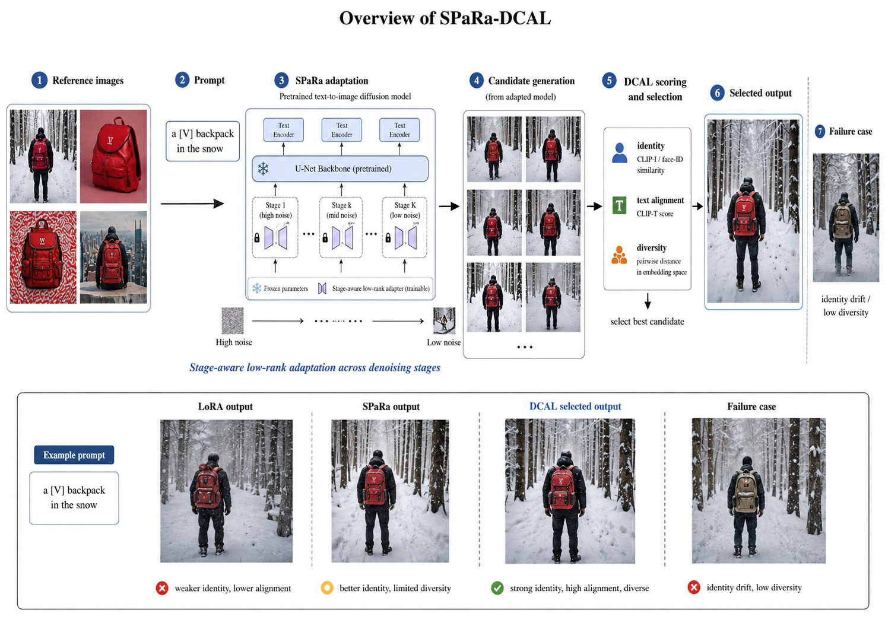

* **AnyMS: Bottom-up Attention Decoupling for Layout-guided and Training-free Multi-subject Customization**

  * 地址：https://arxiv.org/abs/2512.23537
  * 架构图：

  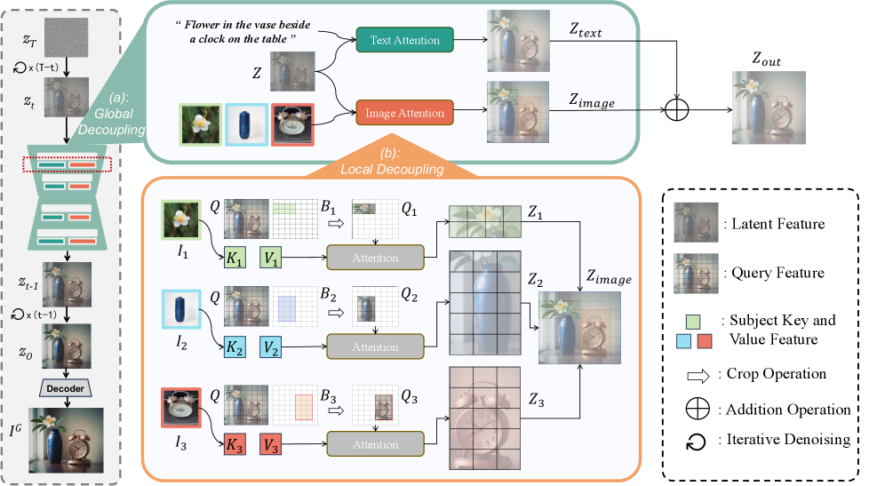

* **FlowFixer: Towards Detail-Preserving Subject-Driven Generation**

  * 地址：https://arxiv.org/abs/2602.21402
  * 架构图：

  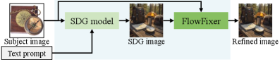

* **MS-CustomNet: Controllable Multi-Subject Customization with Hierarchical Relational Semantics**

  * 地址：https://arxiv.org/abs/2603.21136
  * 架构图：

  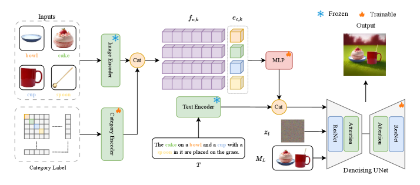

* **SwiftPie: Lightning-fast Subject-driven Image Personalization via One-step Diffusion**

  * 地址：https://arxiv.org/abs/2605.01510
  * 架构图：

  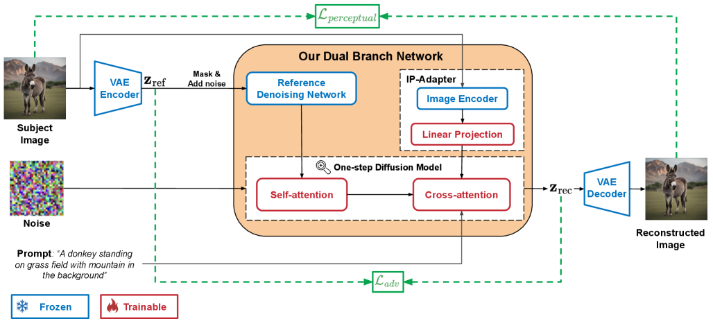

#### 1.4 自回归与其他架构

* **DreamVAR: Taming Reinforced Visual Autoregressive Model for High-Fidelity Subject-Driven Image Generation**

  * 地址：https://arxiv.org/abs/2601.22507
  * 架构图：

  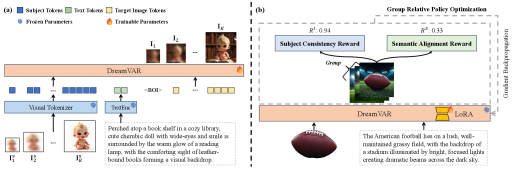

###  2. 测评

* **SconeEval: Benchmark for Subject-Driven Composition and Distinction**

  * 地址：https://huggingface.co/datasets/Ryann829/SconeEval
  * 简介：面向 subject-driven image generation 的组合与区分能力测评集，覆盖复杂参考图、多主体组合和目标主体辨别。

* **DSH-Bench: A Difficulty- and Scenario-Aware Benchmark with Hierarchical Subject Taxonomy for Subject-Driven Text-to-Image Generation**

  * 地址：https://arxiv.org/abs/2603.08090
  * 简介：面向 subject-driven T2I 的分难度、分场景层级测评体系，包含 Subject Identity Consistency Score 等评估指标。

* **MultiBind: A Benchmark for Attribute Misbinding in Multi-Subject Generation**

  * 地址：https://arxiv.org/abs/2603.21937
  * 简介：基于真实多人照片构建的多主体属性错绑测评，分别检查人脸身份、外观、姿态和表情在不同主体之间的混淆。

* **MaSC: A Masked Similarity Metric for Evaluating Concept-Driven Generation**

  * 地址：https://arxiv.org/abs/2605.22469
  * 简介：利用前景主体掩码区分概念保持与提示词遵循，通过单次 SigLIP2 编码同时评估主体一致性和背景语义对齐。

* **RefVNLI: Towards Scalable Evaluation of Subject-driven Text-to-image Generation**

  * 地址：https://arxiv.org/abs/2504.17502
  * 简介：以单次推理联合评估文本对齐和主体保持的低成本指标，覆盖动物、物体等多类主体，并针对人类判断一致性进行训练。

* **Beyond the Pixels: VLM-based Evaluation of Identity Preservation in Reference-Guided Synthesis**

  * 地址：https://arxiv.org/abs/2511.08087
  * 简介：将身份评估分解为类型、风格、属性和具体特征的层级推理，并提供 1,078 组图像—提示词压力测试样本。

* **When Identities Collapse: A Stress-Test Benchmark for Multi-Subject Personalization**

  * 地址：https://arxiv.org/abs/2603.26078
  * 简介：针对 2–10 个主体及普通、遮挡、交互三档场景评估身份坍塌，弥补全局 CLIP 指标难以诊断局部主体混淆的问题。

###  3. 数据集

* **OpenSubject: Leveraging Video-Derived Identity and Diversity Priors for Subject-driven Image Generation and Manipulation**

  * 地址：https://arxiv.org/abs/2512.08294
  * 简介：从视频中构造的 subject-driven generation / manipulation 数据集与 benchmark，包含跨帧身份先验和复杂场景样本。

* **Proteus-Bench: Benchmark for Video Identity Customization**

  * 地址：https://grenoble-zhang.github.io/Proteus-ID/
  * 简介：Proteus-ID 提出的身份一致视频定制训练与测评数据，覆盖身份保持、文本对齐和运动质量评估。

* **PairHuman: A High-Fidelity Photographic Dataset for Customized Dual-Person Generation**

  * 地址：https://arxiv.org/abs/2511.16712
  * 简介：面向双人肖像定制的 10 万级高质量摄影数据集，包含场景、服饰、人物交互、关键点、位置和属性标注。

* **SemAlign-MS: Multi-Subject Dataset with Semantic Point Correspondences**

  * 地址：https://bytedance-fanqie-ai.github.io/MOSAIC/
  * 简介：为多主体生成构建的大规模细粒度语义对应数据集，提供参考主体与目标图像之间的密集语义点对齐监督。

* **IMIG-100K: Image-Guided Multi-Instance Generation Dataset**

  * 地址：https://github.com/nenhang/ContextGen
  * 简介：面向图像引导多实例生成的 10 万级数据集，同时提供多实例身份参考与详细布局标注。

* **MSI: Multi-Subject Customization Dataset with Hierarchical Relational Semantics**

  * 地址：https://arxiv.org/abs/2603.21136
  * 简介：从 COCO 派生的多主体训练集，组合多视角参考主体、布局图与层级关系语义，用于显式控制主体间结构和空间位置。

## Star History

<a href="https://star-history.com/#leeguandong/Awesome-ID-Customization&Date">

  <picture>
    <source media="(prefers-color-scheme: dark)" srcset="https://api.star-history.com/svg?repos=leeguandong/Awesome-ID-Customization&type=Date&theme=dark" />
    <source media="(prefers-color-scheme: light)" srcset="https://api.star-history.com/svg?repos=leeguandong/Awesome-ID-Customization&type=Date" />
    
  </picture>
</a>
